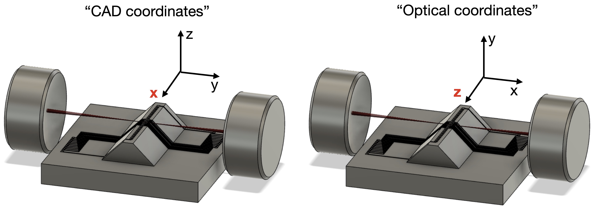
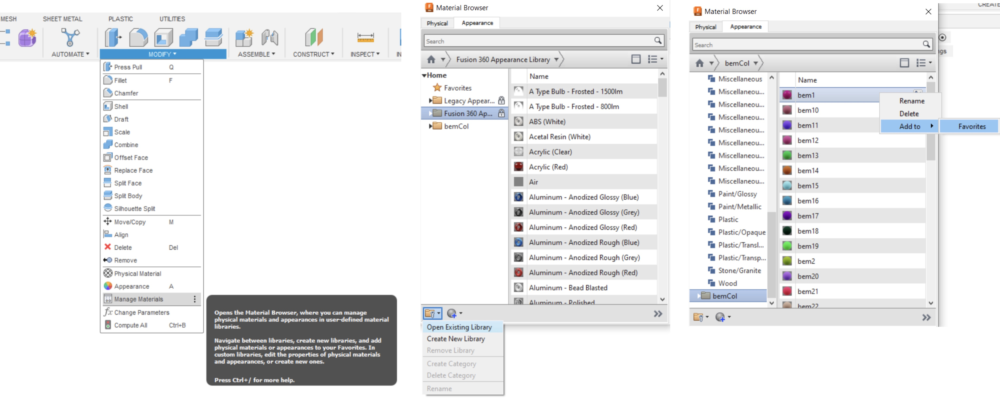
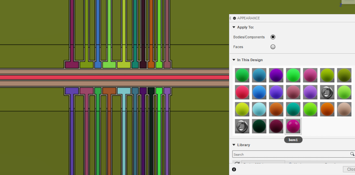
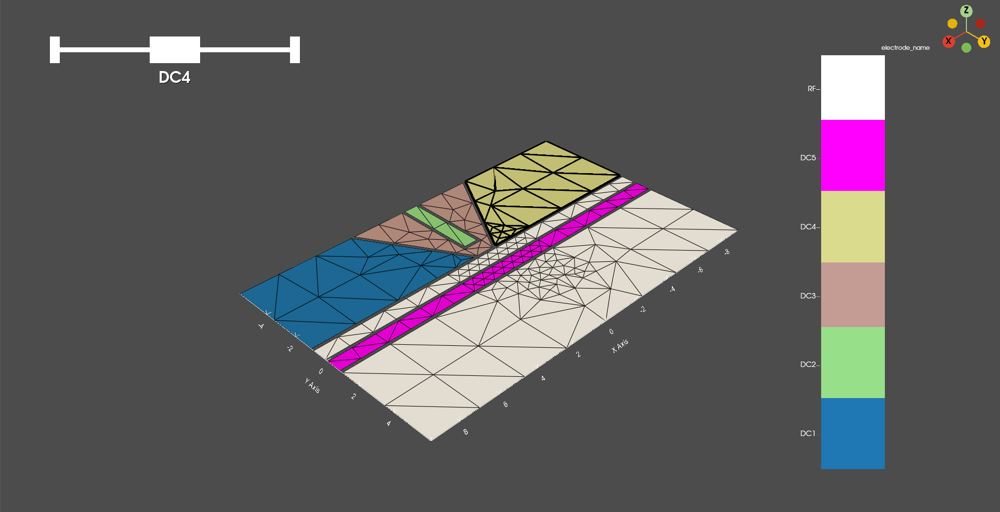
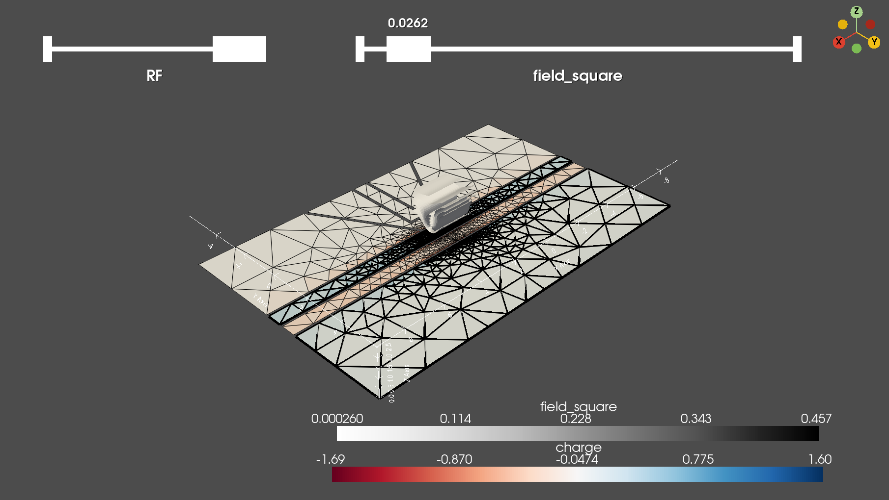
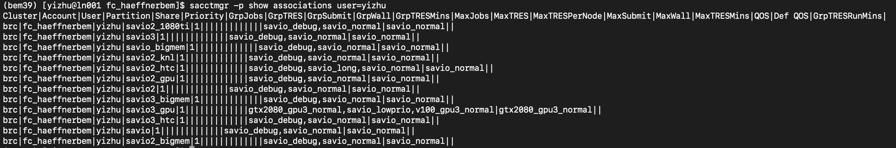

# BEM
BEM is a python package that can simulate electrostatics for ion traps using boundary element method.

This package wraps the fastlap BEM (boundary element method aka BIE boundary integral
equations) + FMM (fast multipole method) + Laplace kernel implementation
from [http://www.rle.mit.edu/cpg/research_codes.htm](http://www.rle.mit.edu/cpg/research_codes.htm). The original code is
in /doc/fastlap_fl-2.0-22oct96 for reference.


## Table of contents
- [Installation](#id-1)
- [Workflow](#id-2)
	1. [Creating the trap model in STL format](#id-3)
	2. [Configuring a new job in BEM](#id-4)
	3. [BEM simulation](#id-5)
	4. [Result analysis](#id-6)
- [Berkeley high performance cluster - Savio](#id-7)
- [Savio Basics](#id-8)

## Installation <div id='id-1'/>
To install BEM on your computer, clone the [bem](https://github.com/HaeffnerLab/bem) directory and create a new conda environment. 

```
conda create -n bem39 python=3.9 
```

Activate the environment. You should see the command prompt change to reflect this (e.g. from base to bem39)

```
conda activate bem39
```

Navigate to the bem directory which contains ```setup.py``` and install BEM


```
pip install .
```

To deactivate the environment,

```
conda deactivate
``` 

The package should be compatible with following systems:
- Windows
- macOS
- Linux


## Workflow <div id='id-2'/>

Each time you run a BEM analysis, the workflow will consist broadly of four distinct tasks:

1. Creating the trap model in STL format
	- Creating a model of the trap
	- Coloring the trap electrodes
	- Exporting the model as an STL
2. Configuring a new job in BEM
	- Importing the STL model into BEM and re-meshing via BEM
	- Check mesh in 3D to make sure all electrodes are imported and meshed properly
	- Configuring simulation parameters in BEM
3. BEM simulation
	- Running the BEM electrostatics simulation to determine the potentials generated by each electrode.
	- The BEM electrostatics can either be run locally (i.e. on your computer) or on a high performance cluster (HPC) compute node (e.g. savio-bigmem with 20 cores and 500 Gb memeory). 
4.  Result analysis
	- View the result in 3D, for example, view electric field square of RF electrodes together with the charge distribution to roughly determine whether the precision is enough
	- Subsequent analysis such as multipole/derivative control will be done using PaulTrapAnalysis package

An example code with annotations can be found in ```examples/SimpleTrap/SimpleTrap.ipynb```. It includes three steps: STL remesh, electrostatic simulation, and 3D visualization of the result.
	


### 1. Creating the trap model in STL format <div id='id-3'/>
There are many ways to create trap model in STL format as long as two requirements are satisfied. Firstly, STL should be in binary format. Secondly, the exported STL has attributes that distinguish electrodes from each other. The attribute can be different colors for different electrodes.

Fusion 360 is the most natural choice to design traps, thus makes it the most convenient choice to export STL. However it requires that the whole trap model is a single body, which is not easy to achieve for some designs. Inventor is similar to Fusion 360 but does not have single body requirement.

Below shows the steps to create and export STL in Fusion 360.

#### 1.1 Coordinates

First, create a model of the trap in Fusion 360. It would be better if your model follows optical coordinates (see figure below). In other words, the trap axis in Fusion 360 is better along the z-axis and the vertical direction.


<center><figcaption>There are two standard conventions for coordinates. In CAD coordinates, x is along the trap axis and in optical coordinates z is along the trap axis. **Throughout BEM, we will always use optical coordinates.**</figcaption></center>

Additionally, ensure that your trap model is a single body in Fusion 360. When exporting, each body becomes its own STL and we wish to have the trap as a single STL.

#### 1.2 Coloring Electrodes

In the Fusion 360 design, the trap is a single body. Therefore, we must be able to distinguish electrode surfaces from one another somehow. This is accomplished by coloring the face of each electrode. Later in BEM, we will identify the electrodes with a mapping between the color used in Fusion 360 and the electrode name.

To facilitate this process, a set of predefined colors for BEM have been created. To import these colors into Fusion 360:

1. In the Modify tab, click on Manage Materials to launch the Material Browser
2. In the Materials Browser, select Appearence on the top bar
3. In the bottom bar of the Material Browser, click on the folder icon, select Open Existing Library and load the BEM color library located ```bem/bemColors_lib/bemColors.adsklib```
4. Now, you should see a bemCol folder appear in the left menu. For *each* color, right click and select Add To/Faviorites



Now color each electrode:

1. Select the face you wish to color
2. Open the Appearance tab (press 'a')
3. Using the search bar, find the appropriate BEM color you wish to use (```bemxx```) and drag that color over the face you wish to color.



<center><figcaption>Sample colored model. Notice bem1 is the top left electrode.</figcaption></center>


Note: make sure to color all surfaces that you wish to be included in the simulation. All surfaces that are not colored (and subsequently renamed in BEM) will be discarded by BEM.

Note: why are we specifically using these colors? STL files do not support colors. A (not-so-standardly) accepted workaround is to use the Attribute data of each triangle face to store color information. However, the Attribute is only 2 bytes long while a RGB color is 3 bytes long. Therefore, in general, the original colors will be modified when being saved to a STL. ```bemCol``` handles these color issues by defining a between the ```bemxx``` colors imported into Fusion 360 and the colors BEM reads when importing the trap STL.  

#### 1.3 Exporting to STL

Finally, export your model as an STL. In Fusion 360, select the trap body using the menu on the left-hand side and select Save as Mesh. Make sure to select

- Format: binary STL

Unit is not restricted. It can always be rescaled in BEM. Millimeter is chosen as a convention in Fusion 360. In Inventor, it can also be micron.

Optionally, you can refine the mesh density when exporting in Fusion 360. However, we will be re-meshing in later steps, so this is not strictly necessary.

### 2. Configuring a new job in BEM <div id='id-4'/> 

Firstly, we can pricess STL file locally and export the base mesh in VTK format. Choosing VTK as the mesh format makes it very easy to visulualize and iterate the mesh parameters interactively. 


<center><figcaption>3D visualization of the processed base mesh. Electrodes are colored differently. The top-left slider can choose different electrode and highlight them with bold edges.</figcaption></center>


Secondly, we can either configure the job in the same Jupyter notebook, or read the mesh with
```
mesh, _ = Mesh.from_vtk(prefix)
```
and write the job in a separate python file. This makes it possible to run the jobs on high performance cluster by simply uploading the job file (e.g. ```examples/SimpleTrap/run.py```), the mesh file (e.g. ```examples/SimpleTrap/SimpleTrap_mesh.vtk```), as well as the job description file (e.g. ```examples/SimpleTrap/saviojob.sh```). 


### 3. BEM simulation <div id='id-5'/> 

Both local and Berkeley's cluster parallel computation can use ipyparallel package, so the code is just the same. In theory, local excecution not only can be done in Jupyter notebook, but also can be achieved by running ```ipython run.py``` in terminal.

Remote excecution on Berkeley HPC (Savio) requires running 
```
sbatch saviojob.sh
```

The data will be saved as VTK files. The file named as ```<prefix>_<electrode name>.vtk``` stores potential, field (RF only), and field square (RF only). The file named as ```<prefix>_<electrode name>_mesh.vtk``` stores the charge distribution, and the final mesh after adaptive mesh during simulation.

### 4. Result analysis <div id='id-6'/> 

Lastly, after we get the results, we can visualize the result by simply calling 
```
Result.view(prefix, '<electrode name>')
```
For example, if we want to visualize the field square of the SimpleTrap's RF electrode, we can simply call ```Result.view(prefix, 'RF')``` in the same folder as the result VTK files. Here is the visualization example


<center><figcaption>3D visualization of the field square of the RF electrode. Charge distribution and contours of the field square are plotted. The top-right slider can move a free contour around.</figcaption></center>

## Berkeley high performance cluster - Savio<div id='id-7'/>

BRC-HPC is a high-performance computing cluster run by Berkeley Research Computing (BRC). The cluster consists broadly of login nodes and compute partitions. Data and software are stored in the cluster within your personal directory or a *shared group directory*. All nodes (login and compute) have access to these directories.


SSH-ing into the cluster is handled by the 4 login nodes (a random node is assigned). You may test commands and scripts within the login in node, but the login nodes are a shared resource and not meant to handle large computational tasks.

To schedule computational tasks (i.e. BEM simulations) to be run on a computing cluster, Savio uses slurm, a job scheduler. This is described in the sections below.

## Savio Basics <div id='id-8'/>

The full user-guide for Savio may be found [here](https://docs-research-it.berkeley.edu/services/high-performance-computing/user-guide/).

Note: if this is the first time you are reading this documentation, I suggest skipping the remainder of this section and returning when you are ready to run BEM on savio and wish to learn the specifics.

### Service Units

Our lab is granted 300,000 yearly service units via Hartmut's faculty allowance. To check that you have access to this computing allowance, login to [MyBRC](https://mybrc.brc.berkeley.edu/user/login) and check that the BRC Cluster Project ```fc_haeffnerbem``` appears on your dashboard. To be added to the project, please contact Hartmut or Yi.

Note: service units are calculated based on the number of cores in the node you requested. E.g., if you run a program for 1 hr on a single core of a 16-core node, you will be charged 16 service units. Therefore, it is in your interest to use as many cores as possible (i.e. as many cores as the available memory allows).

### SSH

To ssh into the a login node, 

```ssh your_BRC_username@hpc.brc.berkeley.edu```

*The password is not your BRC pin*. One-time password authentication via your phone is required. If you have not already, set up OTP via Google Authenticator by following these [directions](https://docs-research-it.berkeley.edu/services/high-performance-computing/user-guide/setting-otp/). The password you must enter is ```XY``` where ```X``` is your BRC pin and immediately following with no spaces is ```Y``` the 6-digit one-time code from Authenticator. 

### Access to the Group Computing Allowance

The hardware configurations for each of the Savio partitions may be found [here](https://docs-research-it.berkeley.edu/services/high-performance-computing/user-guide/hardware-config/#Savio-Hardware). To find which accounts and partitions you have access to,

```sacctmgr -p show associations user=$USER```



Since our simulations are generally limited by memory, we generally would like to choose bigmem nodes.

### Modules and Custom Software

A number of modules are installed in Savio. These modules can be loaded with the `module` command. For example, every time we run BEM, we want to first load Python (you can run Python without loading the Python module, but it is an outdated version).

`module load python`

**Note: this is a commonly forgotten step**

A final quirk in using conda environments on Savio *not* using the normal `conda activate module_name` but rather,

`source activate module_name`

**This is also common source of error.**


### Scheduling and Monitoring Jobs with slurm

TODO TALK ABOUT SLURM SBATCH

The ```sq``` module shows recent and pending jobs,

```
module load sq
sq
```


Note: the directory where you run the ```sbatch``` command is the directory where you batch script runs.

Note: you have to deactivate the enviornment before running the sbatch command

### Transferring Data

Data transfer can be done using Globus. The directions can be found [here](https://docs-research-it.berkeley.edu/services/high-performance-computing/user-guide/data/transferring-data/using-globus-connect-savio/).
